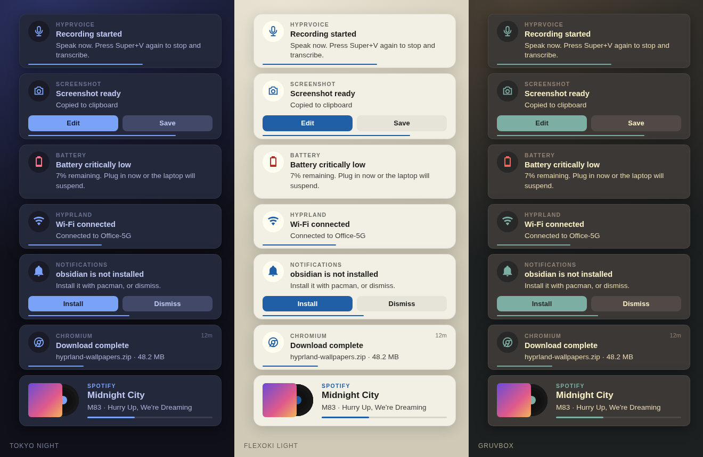

# Notifications

Notifications are served and rendered by the persistent Quickshell process.
Applications talk to `org.freedesktop.Notifications`; one service normalises the
event, persists it, applies DND, and either shows it in the top-right stack of
every monitor or writes it silently to history.

```text
application → Quickshell NotificationServer → NotificationService
                                              ├── active / history state
                                              ├── per-output card stack
                                              └── notifications IPC
```

SwayNC is a retained rollback backend. Its autostart line is commented out, and
no notification data is shared between the two.

The `systemd` package also masks `swaync.service` with an empty unit file, which
systemd treats the same as a link to `/dev/null`.
Without the mask, the swaync package's D-Bus activation file starts SwayNC as soon
as any program sends a notification before Quickshell has registered, which
happens at every login. SwayNC then keeps `org.freedesktop.Notifications`, and
Quickshell only logs `Could not register notification server`. Popups keep
appearing, but they bypass Quickshell's DND and history.

## Surfaces

The full-screen layer-shell surfaces use the **overlay** layer, request no
keyboard focus and no exclusion zone, and have an input mask made only from the
individual visible card rectangles. Space between cards and shadows outside
those rectangles are therefore click-through.

The Quickshell bar is authoritative, so top-anchored notifications clear
`Theme.barHeight` plus the normal outer gap.

Every card is drawn on every monitor. Each card is still assigned an origin
monitor, Hyprland's focused monitor when it arrives, and that monitor's copy
owns the expiry timer, so hovering the card there pauses its deadline. A
disconnected output is deterministically remapped to the current focused
monitor.

## Controls

| Binding | Action |
| --- | --- |
| `SUPER+,` | dismiss the newest visible card |
| `SUPER+SHIFT+,` | dismiss all visible cards |
| `SUPER+CTRL+,` | toggle persistent DND, through `desktop-mode` |
| `SUPER+ALT+,` | invoke or focus the newest card |
| `SUPER+SHIFT+ALT+,` | replay the newest 10 history entries |
| `SUPER+D` | toggle persistent DND, through `desktop-mode` |

The bindings contain no notification logic — they call `notificationctl`, or
`desktop-mode` for DND. The `desktop-mode` daemon re-applies its DND state every
few seconds, so `notificationctl dnd-*` changes made outside it do not stick.

Pressing a binding for a program that is not installed sends a notification
from `run-or-install` with **Install** and **Dismiss** action buttons. See
[Scripts and CLIs](Scripts-and-CLIs.md#missing-programs).

```bash
notificationctl dismiss-one
notificationctl dismiss-all
notificationctl dnd-toggle
notificationctl dnd-on
notificationctl dnd-off
notificationctl invoke-latest
notificationctl history
notificationctl status
notificationctl status --json
```

`notificationctl` is a Python wrapper around Quickshell IPC. Commands prefixed
with `_` are private and used by `NotificationPersistence.qml` for filesystem
work; they take JSON on stdin specifically so notification text is never parsed
by a shell.

## Card behaviour

Left click invokes the live default action. If there is no live action it falls
back to matching `desktop-entry`, then app name, then icon, against Hyprland
window classes — so clicking a restored or replayed card focuses the right
application instead of pretending an expired action still works.

Right click, or the hover close button, dismisses. Hovering pauses the deadline.

Critical cards stay until acted on. Low and normal cards last at least 5 and 8
seconds, and ordinary requests are clamped to 30 seconds.

## Configuration

`quickshell/.config/quickshell/notifications/config.json`:

| Setting | Default |
| --- | --- |
| `position` | `top-right` |
| `historyLimit` | 10 |
| `defaultDnd` | `false` |
| `lowTimeoutMs` | 5000 |
| `normalTimeoutMs` | 8000 |
| `ordinaryMaxTimeoutMs` | 30000 |
| `cardWidth` | 380 |
| `stackGap`, `sidePadding` | 8, 12 |
| `iconSize`, `iconGap`, `closeSize` | 40, 12, 18 |
| `multiLinePadding` | 10 — vertical padding for all cards |
| `countdownHeight` | 2 |
| `vinylSize` | 64 — album sleeve size on Spotify track cards (record + live progress bar from `MediaState`) |
| `animationMs`, `closeFadeMs` | 130, 100 |
| `debug` | `false` |
| `dndBypassApps` | `Do Not Disturb`, `Night Light`, `Capture`, `Battery`, `Web Apps` |

A DND bypass requires **both** an allow-listed app name **and** an explicit local
bypass hint. Urgency alone never bypasses DND.

The former `borderWidths`, `singleLinePadding`, and `glyphGap` options are no
longer used by the elevated card layout.

## State

Private and atomic, under `$XDG_STATE_HOME/hyprland-desktop/notifications/`
(falling back to `~/.local/state`):

```text
state.json       persistent DND flag
active/          cards restored after a shell restart
history/         newest 10 by default
images/          bounded copies owned by retained records
```

The safety properties are deliberate: malformed JSON is skipped rather than
fatal, filenames are validated, notification text never goes through a shell,
writes use fsync plus rename, and orphaned images are swept.

## Theming

Cards are the theme's surface colour raised off the wallpaper by a soft shadow:
a small uppercase app label, a round icon badge on the window background
colour, the title and body, and a short countdown line along the bottom edge.
Replayed history cards also show their age (`now`, `5m`, `3h`) in the header.
Action buttons appear only when the notification sends actions; the first is
filled with the accent (the critical colour on critical cards) and the rest
stay quiet on the surface-alt colour. Actions wrap onto additional rows when
needed to keep buttons usable. Spotify track cards keep their vinyl
layout inside the same shell.

Theme roles are generated for every palette as `notifications.background`,
`surface`, `shadow`, `text`, `bodyText`, `actionText`, `criticalActionText`,
`countdown`, and `close`. Action foregrounds are selected for contrast against
their fill. The QML contains no notification palette of its own; shadow opacity
follows the theme and corner radius is Hyprland rounding plus four scaled pixels.



## Implementation

`quickshell/.config/quickshell/notifications/`:

| File | Role |
| --- | --- |
| `NotificationRoot.qml` | mounted by `shell.qml`; wires the pieces together |
| `NotificationServer.qml` | owns the `org.freedesktop.Notifications` D-Bus name |
| `NotificationService.qml` | normalisation, DND, routing, lifetimes |
| `NotificationPersistence.qml` | state, history, and image files via `notificationctl` |
| `NotificationStack.qml`, `NotificationOverlay.qml` | per-output surface and layout; every output shows every card |
| `NotificationCard.qml`, `NotificationActions.qml` | the card itself |
| `NotificationConfig.qml` | reads `config.json` |
| `NotificationLogic.js` | pure logic, unit-tested from Node |
| `config.json` | user settings |
| `tests/` | Python and JavaScript unit tests |

The card component is shared by live and replayed history cards.

## Testing

```bash
notify-send "Test notification" "This is the body."
notify-send -u low "Low urgency" "At least five seconds"
notify-send -u critical "Critical" "Dismiss explicitly"

QT_QPA_PLATFORM=offscreen quickshell -p quickshell/.config/quickshell/NotificationSmoke.qml
python3 -m unittest discover -s quickshell/.config/quickshell/notifications/tests -p 'test_*.py'
node quickshell/.config/quickshell/notifications/tests/notification_logic.test.js
```

With optional `PySide6` installed, the Python suite also runs the production
card and stack QML offscreen with fixture services. It checks narrow/scaled
layouts, action clicks, replay ages, icon fallback, vinyl layout, and per-card
mask membership without connecting to the desktop. This does not validate
native Wayland input delivery or GPU shadow rendering.

## Rolling back to SwayNC

Remove the mask (`rm ~/.config/systemd/user/swaync.service`, then
`systemctl --user daemon-reload`), stop Quickshell, start `swaync.service`, and
restore the two former comma bindings to `~/.config/hypr/scripts/dnd.sh`. The
SwayNC package and its theme template are still in the repository. Bindings
that call `notificationctl` will not reach SwayNC as written.
